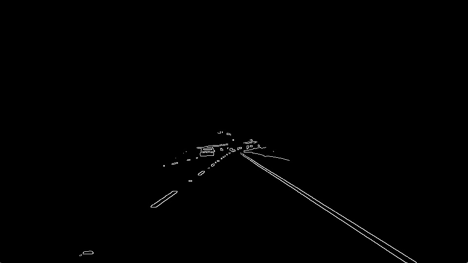

# **Finding Lane Lines on the Road** 

---

**Finding Lane Lines on the Road**

The goals / steps of this project are the following:
* Make a pipeline that finds lane lines on the road
* Reflect on your work in a written report

[//]: # (Image References)

[image1]: ./examples/grayscale.jpg "Grayscale"

---

### Reflection

### 1. Describe your pipeline. As part of the description, explain how you modified the draw_lines() function.

My pipeline consisted of 5 steps. 

Step 1, I selected region of interest based on color range using cv2.inrange(), with lower bound (105, 135, 120), upper bound (255, 255, 255).

Step 2, I applied canny edge dections on the selected region in Step 1, with *lower threshold = 70*, and *upper threshold = 210*.

Step 3, I selected region of interest based on the possible road location, which is a ladder shape streching from the bottom to the center line of the image.

Step 4, I used hough transform to find the lines on the image, and draw a single line for the left and right lanes repectively.

Step 5, I layered the original image with the line image together to get a complete result.

In order to draw a single line on the left and right lanes, I modified the draw_lines() function by first selecting the piece of lines with steepest negative and positive slopes as left and right lane，and second stretching the lines to the upper bound and lower bound of the region of interest.

### 2. Identify potential shortcomings with your current pipeline

One potential shortcoming would be what would happen when the lane on the image is composed of several segments of lines with different slopes, and therefore inaccurate lane would be drawed on the image.

Another shortcoming could be when color of the lane on the image is so light that the color selector could not find it.

### 3. Suggest possible improvements to your pipeline

A possible improvement would be connecting segments of lines on the lane, instead of finding the line with the steepest slope.

Another potential improvement could be to combine color selector with other selectors, or applied predictions for the location of the lane(s).